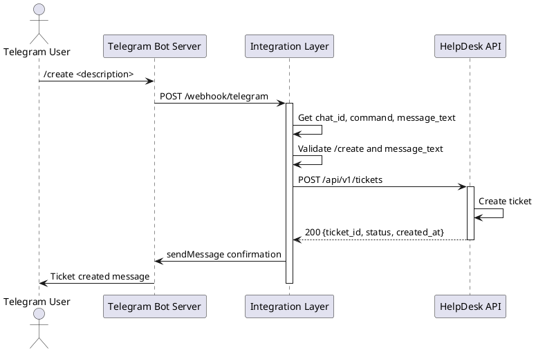
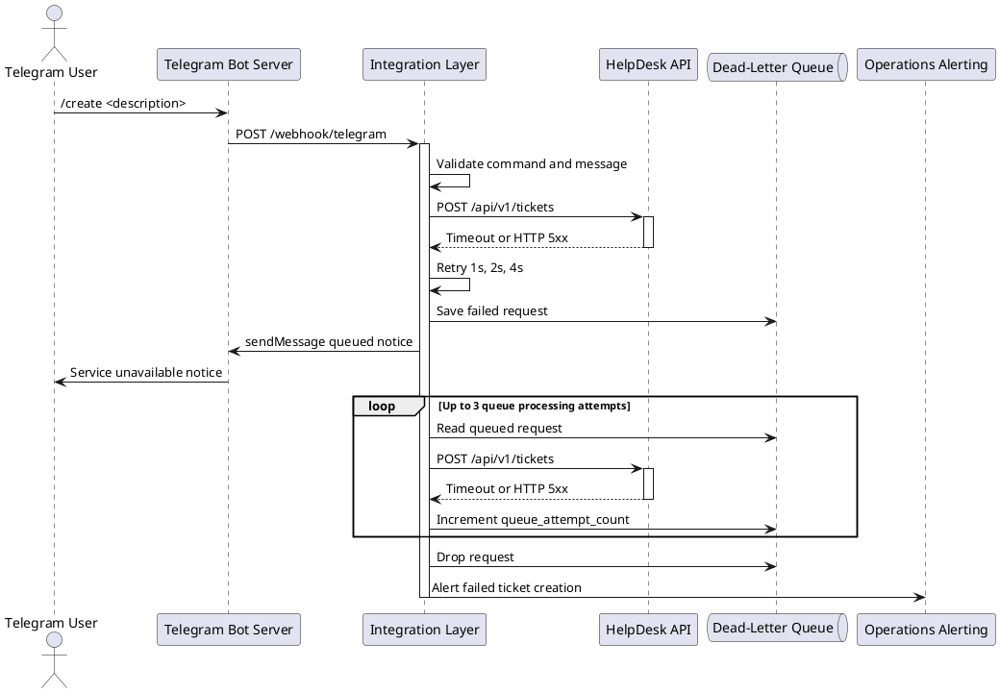

# Technical Requirements Document: Telegram Bot Integration with HelpDesk Ticket Management System

## Glossary

| Term | Definition |
|------|------------|
| Token | A 2048-bit alphanumeric string from BotFather. The Integration Layer uses it to authenticate Telegram Bot API requests. |
| Chat ID | A 64-bit signed integer that identifies a Telegram conversation between a user and the bot. Example: `-1001234567890`. |
| Ticket | A HelpDesk record for a customer support request. It stores an ID, description, status, priority, timestamps, and assigned agent. |
| Ticket Status | A ticket lifecycle state. Allowed values are `OPEN`, `IN_PROGRESS`, `RESOLVED`, and `CLOSED`. The normal flow is `OPEN -> IN_PROGRESS -> RESOLVED -> CLOSED`. |
| Webhook | An HTTP POST callback from Telegram or HelpDesk to a configured HTTPS endpoint. |
| Integration Layer | Middleware between Telegram Bot API and HelpDesk API. It parses commands, validates payloads, maps statuses, and handles retries. |
| HelpDesk API | A REST API for ticket records and status change events. |
| Agent | A HelpDesk operator who can view tickets and update ticket properties. |
| Bot Command | A Telegram message that starts with `/`. Examples: `/create` and `/status`. |
| Dead-Letter Queue | Storage for failed HelpDesk requests that need later processing or operational review. |

## Use Cases

### UC-01: Customer creates a ticket via bot

**Use Case ID**: UC-01  
**Name**: Customer creates a ticket via bot  
**Primary Actor**: Customer (Telegram User)  
**Preconditions**:  
1. Telegram Bot is deployed and has a valid Bot Token.  
2. Integration Layer is operational and has valid HelpDesk API credentials.  
3. HelpDesk API is available.  
4. Customer has started a chat with the bot.  
5. Bot has the Customer's Chat ID.  

**Main Success Scenario**:  
1. Customer sends `/create <description>` to Telegram Bot.  
2. Telegram Bot Server sends webhook `POST /webhook/telegram` to Integration Layer.  
3. Integration Layer gets `chat_id`, `command`, and `message_text` from the webhook.  
4. Integration Layer validates `command` equals `/create`.  
5. Integration Layer validates `message_text`.  
6. Integration Layer sends `POST /api/v1/tickets` to HelpDesk API.  
7. Payload includes `chat_id`, `command`, `message_text`, `status`, `priority`, and `created_at`.  
8. HelpDesk API validates the payload.  
9. HelpDesk API creates the ticket with status `OPEN`.  
10. HelpDesk API generates `ticket_id` as UUID v4.  
11. HelpDesk API returns HTTP 200 with `{ticket_id, status, created_at}`.  
12. Integration Layer sends Telegram `sendMessage` with `Ticket created. ID: {ticket_id}`.  
13. Telegram Bot Server delivers the confirmation to Customer.  

**Alternative Flows**:  
- **1a**: Customer sends text without `/create`. Integration Layer sends: "Use /create <description> to create a ticket." Use case terminates.  
- **4a**: Command is not `/create`. Integration Layer ignores ticket creation and routes the command to its matching use case.  
- **5a**: Validation fails. Integration Layer sends: "Message must be 10-2000 characters." Use case terminates.  
- **6a**: HelpDesk API returns HTTP 400 or 422. Integration Layer sends: "Invalid request. Please check your message (10-2000 characters)." Use case terminates.  
- **6b**: HelpDesk API returns HTTP 403. Integration Layer sends: "Access denied." Use case terminates.  
- **6c**: HelpDesk API returns HTTP 404. Integration Layer sends: "Endpoint not found. Contact support." Use case terminates.  
- **6d**: HelpDesk API returns HTTP 5xx. Integration Layer retries up to 3 times with 1s, 2s, and 4s backoff.  
- **6e**: All retries fail. Integration Layer sends: "Service unavailable. Your message has been queued for retry." Use case continues in UC-04.  

**Postconditions**:  
1. Ticket record exists in HelpDesk system with status `OPEN`.  
2. Customer has received confirmation with `ticket_id`.  
3. HelpDesk system stores Chat ID with `ticket_id`.  

---

### UC-02: Agent updates ticket status in HelpDesk and customer receives Telegram notification

**Use Case ID**: UC-02  
**Name**: Agent updates ticket status in HelpDesk and customer receives Telegram notification  
**Primary Actor**: Agent (HelpDesk Operator)  
**Preconditions**:  
1. Ticket exists in HelpDesk system with stored Chat ID from original creation (UC-01).  
2. Integration Layer has a HelpDesk webhook subscription for status changes.  
3. Telegram Bot is operational.  

**Main Success Scenario**:  
1. Agent opens the ticket in HelpDesk system.  
2. Agent selects a new status.  
3. Agent submits the status update.  
4. HelpDesk system updates the ticket record.  
5. HelpDesk system sets `updated_at`.  
6. HelpDesk system sends webhook `POST /api/v1/webhook/ticket-update`.  
7. Integration Layer receives `{ticket_id, status, updated_at, agent_name, chat_id}`.  
8. Integration Layer validates `chat_id`.  
9. Integration Layer validates `status`.  
10. Integration Layer sends Telegram `sendMessage` with the status update.  
11. Telegram Bot Server delivers the notification to Customer.  

**Alternative Flows**:  
- **8a**: Chat ID is null or empty. Integration Layer logs: "No Chat ID for ticket {ticket_id}." Use case terminates.  
- **9a**: Status is not allowed. Integration Layer logs the invalid payload. Use case terminates.  
- **10a**: Telegram Bot API returns HTTP 403. Integration Layer disables notifications for this Chat ID. Use case terminates.  
- **10b**: Telegram Bot API returns HTTP 429. Integration Layer waits for `Retry-After` or uses exponential backoff.  

**Postconditions**:  
1. Ticket status is updated in HelpDesk system.  
2. Customer has received Telegram notification when Chat ID is valid.  
3. Integration Layer has logged the event for audit.  

---

### UC-03: Customer queries ticket status via bot command

**Use Case ID**: UC-03  
**Name**: Customer queries ticket status via bot command  
**Primary Actor**: Customer (Telegram User)  
**Preconditions**:  
1. Customer has created at least one ticket.  
2. Customer knows the `ticket_id` to query.  
3. Integration Layer is operational.  

**Main Success Scenario**:  
1. Customer sends `/status <ticket_id>` to Telegram Bot.  
2. Telegram Bot Server sends webhook `POST /webhook/telegram` to Integration Layer.  
3. Integration Layer gets `chat_id` and `ticket_id` from the webhook.  
4. Integration Layer validates the command syntax.  
5. Integration Layer validates `ticket_id` format.  
6. Integration Layer sends `GET /api/v1/tickets/{ticket_id}` to HelpDesk API.  
7. HelpDesk API returns ticket details and stored Chat ID.  
8. Integration Layer verifies the ticket belongs to the requesting Chat ID.  
9. Integration Layer formats the status response.  
10. Integration Layer sends Telegram `sendMessage` with the response.  
11. Telegram Bot Server delivers the message to Customer.  

**Alternative Flows**:  
- **4a**: Command syntax is invalid. Integration Layer sends: "Usage: /status <ticket_id>." Use case terminates.  
- **5a**: `ticket_id` format is invalid. Integration Layer sends: "Invalid ticket ID format. Expected UUID format." Use case terminates.  
- **4c**: Integration Layer queries HelpDesk and sees that `ticket_id` does not belong to the requesting Chat ID. It sends: "Access denied: ticket not associated with your account." Use case terminates.  
- **6a**: HelpDesk API returns HTTP 404. Integration Layer sends: "Ticket not found." Use case terminates.  
- **6b**: HelpDesk API returns HTTP 403. Integration Layer sends: "Access denied." Use case terminates.  
- **8a**: HelpDesk returns no stored Chat ID. Integration Layer sends: "Ticket not associated with your account." Use case terminates.  

**Postconditions**:  
1. Customer has received current ticket status information.  
2. Integration Layer has logged the query for audit.  

---

### UC-04: Bot receives a message when HelpDesk system is unavailable

**Use Case ID**: UC-04  
**Name**: Bot receives a message when HelpDesk system is unavailable  
**Primary Actor**: System (Integration Layer)  
**Preconditions**:  
1. Customer sends `/create <description>` to Telegram Bot.  
2. HelpDesk API is unreachable or returns HTTP 5xx.  
3. Integration Layer has retry and dead-letter queue processing configured.  

**Main Success Scenario**:  
1. Customer sends `/create <description>` to Telegram Bot.  
2. Telegram Bot Server sends webhook `POST /webhook/telegram` to Integration Layer.  
3. Integration Layer validates the command and message.  
4. Integration Layer sends `POST /api/v1/tickets` to HelpDesk API.  
5. HelpDesk API times out or returns HTTP 5xx.  
6. Integration Layer logs the error with timestamp and Chat ID.  
7. Integration Layer retries after 1 second.  
8. Integration Layer retries after 2 seconds.  
9. Integration Layer retries after 4 seconds.  
10. All immediate retries fail.  
11. Integration Layer saves the request to the dead-letter queue.  
12. Queue entry includes `chat_id`, `command`, `message_text`, `timestamp`, `failure_reason`, and `queue_attempt_count`.  
13. Integration Layer sends: "Service unavailable. Your message has been queued for retry."  
14. Integration Layer schedules queue processing after 300 seconds.  
15. Background task retries queued requests up to 3 processing attempts.  
16. Background task drops the request after 3 failed processing attempts.  
17. Background task alerts operations after it drops the request.  

**Alternative Flows**:  
- **7a**: Any immediate retry succeeds. Integration Layer resumes UC-01 at the successful HelpDesk response.  
- **15a**: A queue processing attempt succeeds. Integration Layer removes the request from the queue.  
- **15b**: HelpDesk is still unavailable. Integration Layer increments `queue_attempt_count` and reschedules processing.  
- **16a**: Telegram Bot API is unavailable. Integration Layer logs a critical error and alerts operations.  

**Postconditions**:  
1. Customer has received an error notification when Telegram is available.  
2. Failed request is saved in the dead-letter queue until it succeeds or reaches the limit.  
3. Operations receives an alert after 3 failed queue processing attempts.  

---

### UC-05: Customer exceeds rate limit for ticket creation

**Use Case ID**: UC-05  
**Name**: Customer exceeds rate limit for ticket creation  
**Primary Actor**: Customer (Telegram User)  
**Preconditions**:  
1. Customer has created a ticket within the last 60 seconds.  
2. Integration Layer enforces ticket creation rate limits per Chat ID.  
3. Rate limiting applies only to `/create` commands.  
4. HelpDesk API is available.  

**Main Success Scenario**:  
1. Customer sends another `/create <description>` within 60 seconds.  
2. Telegram Bot Server sends webhook `POST /webhook/telegram` to Integration Layer.  
3. Integration Layer gets Chat ID from the webhook.  
4. Integration Layer checks the rate limit cache.  
5. Integration Layer detects more than 1 `/create` request per 60 seconds.  
6. Integration Layer does not call HelpDesk API.  
7. Integration Layer sends: "Rate limit exceeded. Please wait 60 seconds between ticket submissions."  
8. Telegram Bot Server delivers the message to Customer.  

**Alternative Flows**:  
- **4a**: Rate limit has expired. Integration Layer continues with UC-01.  
- **5a**: Message is not a `/create` command. Integration Layer does not apply ticket creation rate limiting.  
- **7a**: Telegram Bot API returns HTTP 429. Integration Layer waits for `Retry-After` or uses exponential backoff.  

**Postconditions**:  
1. No extra ticket is created in HelpDesk system.  
2. Customer has received a rate limit notification.  
3. Rate limit cache timestamp for Chat ID remains unchanged.  

## Data Requirements

### Ticket Creation Request Payload

| Field name | Data type | Required | Max length / allowed values | Validation rule | Notes |
|------------|-----------|----------|----------------------------|-----------------|-------|
| chat_id | Integer (64-bit signed) | Yes | -9999999999 to -1 or 1 to 2147483647 | Must match pattern `^-?[0-9]{1,19}$` | Telegram Chat ID obtained from webhook |
| command | String | Yes | `/create` | Must exactly equal `/create` | Identifies ticket creation request |
| message_text | String | Yes | 10-2000 characters | Non-null, non-empty, no null bytes, UTF-8 encoded | Customer's ticket description after `/create` |
| status | String | Yes | Enum: `OPEN`, `IN_PROGRESS`, `RESOLVED`, `CLOSED` | Must match exact enum value | Default: `OPEN` for creation |
| priority | String | No | Enum: `LOW`, `MEDIUM`, `HIGH`, `URGENT` | Must match exact enum value if present | Default: `MEDIUM` |
| created_at | String (ISO-8601) | Yes | Format: `YYYY-MM-DDTHH:MM:SSZ` | Must be valid UTC timestamp | Set by Integration Layer |

### Ticket Status Update Event Payload

| Field name | Data type | Required | Max length / allowed values | Validation rule | Notes |
|------------|-----------|----------|----------------------------|-----------------|-------|
| ticket_id | String (UUID v4) | Yes | 36 characters | Pattern: `/^[0-9a-f]{8}-[0-9a-f]{4}-[0-9a-f]{4}-[0-9a-f]{4}-[0-9a-f]{12}$/i` | Unique ticket identifier |
| status | String | Yes | Enum: `OPEN`, `IN_PROGRESS`, `RESOLVED`, `CLOSED` | Must match exact enum value | New status after update |
| updated_at | String (ISO-8601) | Yes | Format: `YYYY-MM-DDTHH:MM:SSZ` | Must be valid UTC timestamp | Set by HelpDesk system |
| agent_name | String | No | 1-100 characters | Alphanumeric and spaces if present | Agent display name |
| chat_id | Integer (64-bit signed) | Yes | -9999999999 to -1 or 1 to 2147483647 | Must match pattern `^-?[0-9]{1,19}$` | Stored from original ticket creation |

### Bot Command Response Payload

| Field name | Data type | Required | Max length / allowed values | Validation rule | Notes |
|------------|-----------|----------|----------------------------|-----------------|-------|
| chat_id | Integer (64-bit signed) | Yes | -9999999999 to -1 or 1 to 2147483647 | Must match pattern `^-?[0-9]{1,19}$` | Target Telegram conversation |
| text | String | Yes | 1-4096 characters | Non-null, non-empty, UTF-8 encoded | Message content to display |
| ticket_id | String (UUID v4) | Conditional | 36 characters | Required for status responses | Present in status query responses |
| status | String | Conditional | Enum: `OPEN`, `IN_PROGRESS`, `RESOLVED`, `CLOSED` | Required for status responses | Current ticket status |
| priority | String | No | Enum: `LOW`, `MEDIUM`, `HIGH`, `URGENT` | Must match exact enum value if present | Ticket priority |
| created_at | String (ISO-8601) | Conditional | Format: `YYYY-MM-DDTHH:MM:SSZ` | Required for status responses | Ticket creation timestamp |
| updated_at | String (ISO-8601) | Conditional | Format: `YYYY-MM-DDTHH:MM:SSZ` | Required for status responses | Last update timestamp |
| agent_name | String | No | 1-100 characters | Alphanumeric and spaces if present | Assigned agent display name |

### Dead-Letter Queue Entry Payload

| Field name | Data type | Required | Max length / allowed values | Validation rule | Notes |
|------------|-----------|----------|----------------------------|-----------------|-------|
| chat_id | Integer (64-bit signed) | Yes | -9999999999 to -1 or 1 to 2147483647 | Must match pattern `^-?[0-9]{1,19}$` | Originating Chat ID |
| command | String | Yes | `/create` | Must exactly equal `/create` | Original command |
| message_text | String | Yes | 10-2000 characters | Non-null, non-empty, no null bytes | Original ticket description |
| timestamp | String (ISO-8601) | Yes | Format: `YYYY-MM-DDTHH:MM:SSZ` | Must be valid UTC timestamp | Time of original request |
| failure_reason | String | Yes | 10-500 characters | Error code and description | Example: `HELPDESK_TIMEOUT: Connection refused after 30s` |
| immediate_retry_count | Integer | Yes | 0-3 | Non-negative integer | Retries before queue insertion |
| queue_attempt_count | Integer | Yes | 0-3 | Non-negative integer | Queue processing attempts |

## System Interaction Diagram

### PlantUML Sequence Diagram

**Happy Path: Ticket Creation**

**Error Path: HelpDesk Unavailable**

### Component Interaction List (Plain Text)

**Happy Path: Ticket Creation**

1. Telegram User sends `/create <description>` to Telegram Bot Server.
2. Telegram Bot Server sends webhook `POST /webhook/telegram`.
3. Integration Layer gets `chat_id`, `command`, and `message_text`.
4. Integration Layer validates `/create`.
5. Integration Layer validates `message_text`.
6. Integration Layer checks the Chat ID rate limit.
7. Integration Layer sends `POST /api/v1/tickets`.
8. Payload includes `chat_id`, `command`, `message_text`, `status`, `priority`, and `created_at`.
9. HelpDesk API validates the payload.
10. HelpDesk API creates the ticket record.
11. HelpDesk API stores the Chat ID with the ticket.
12. HelpDesk API generates `ticket_id` as UUID v4.
13. HelpDesk API returns HTTP 200 with `ticket_id`, `status`, and `created_at`.
14. Integration Layer formats the confirmation message.
15. Integration Layer sends Telegram `sendMessage`.
16. Telegram Bot Server delivers the confirmation.
17. Telegram User receives the ticket ID.

**Error Path: HelpDesk Unavailable**

1. Telegram User sends `/create <description>` to Telegram Bot Server.
2. Telegram Bot Server sends webhook `POST /webhook/telegram`.
3. Integration Layer gets `chat_id`, `command`, and `message_text`.
4. Integration Layer validates `/create`.
5. Integration Layer validates `message_text`.
6. Integration Layer sends `POST /api/v1/tickets`.
7. Integration Layer uses a 30-second HelpDesk timeout.
8. HelpDesk API times out or returns HTTP 5xx.
9. Integration Layer logs timestamp, Chat ID, and failure reason.
10. Integration Layer retries after 1 second.
11. Integration Layer retries after 2 seconds.
12. Integration Layer retries after 4 seconds.
13. All immediate retries fail.
14. Integration Layer saves the request to the dead-letter queue.
15. Queue entry stores `queue_attempt_count` as `0`.
16. Integration Layer sends Telegram `sendMessage` with the queued notice.
17. Telegram Bot Server delivers the error message.
18. Integration Layer schedules queue processing after 300 seconds.
19. Background task retries the queued request.
20. Background task increments `queue_attempt_count` after each failed attempt.
21. Background task retries up to 3 queue processing attempts.
22. Background task removes the request if HelpDesk accepts it.
23. Background task drops the request after 3 failed attempts.
24. Background task alerts operations after it drops the request.
